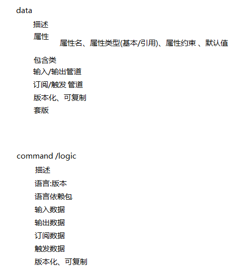

# 目标: 上生产

DataBoard: 

​	authorized login: github

​	data_struct/logic_data: push/pull/fetch

​	display&search public

​	finish single scenes

# 总体来说

从数据的角度驱动由分发、组装由数据和指令库构造的逻辑

# LaasHub 组成元素

## 工作站	

### 设计器

### 用户面板

#### 数据面板

##### 数据操作

##### 数据展示

###### 套版

###### 拓扑

##### 数据状态

###### 日志

###### 监控

###### 告警

#### 使用者面板

##### 用户

##### 角色

##### 流程

##### 权限

#### 审计

## 分发库

分发器分发逻辑业务

## 执行引擎

引擎执行逻辑业务

